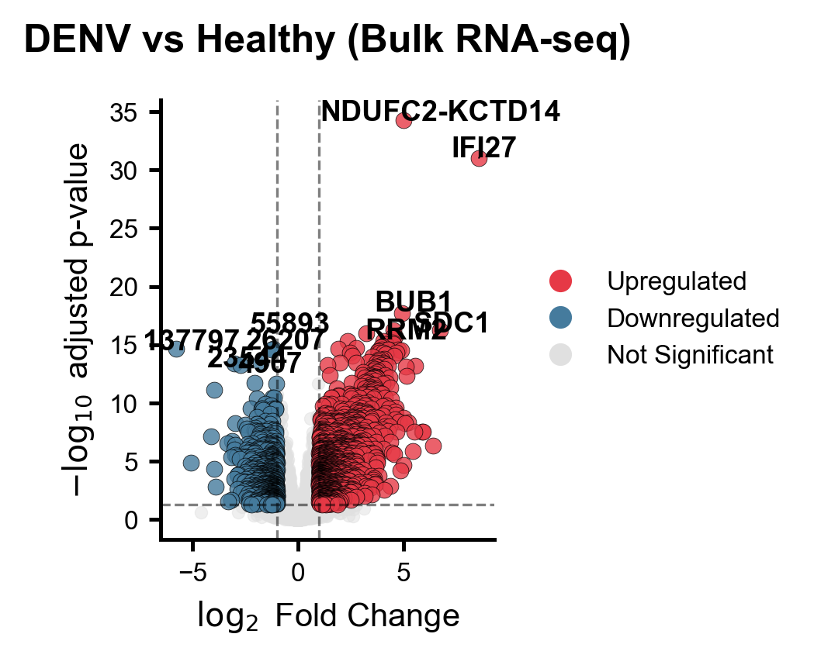
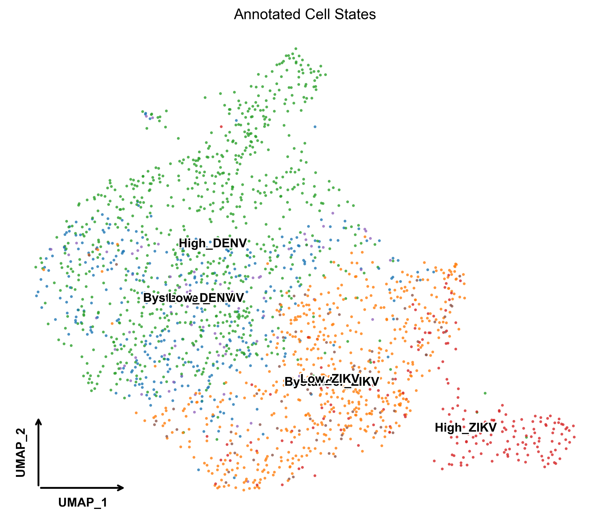
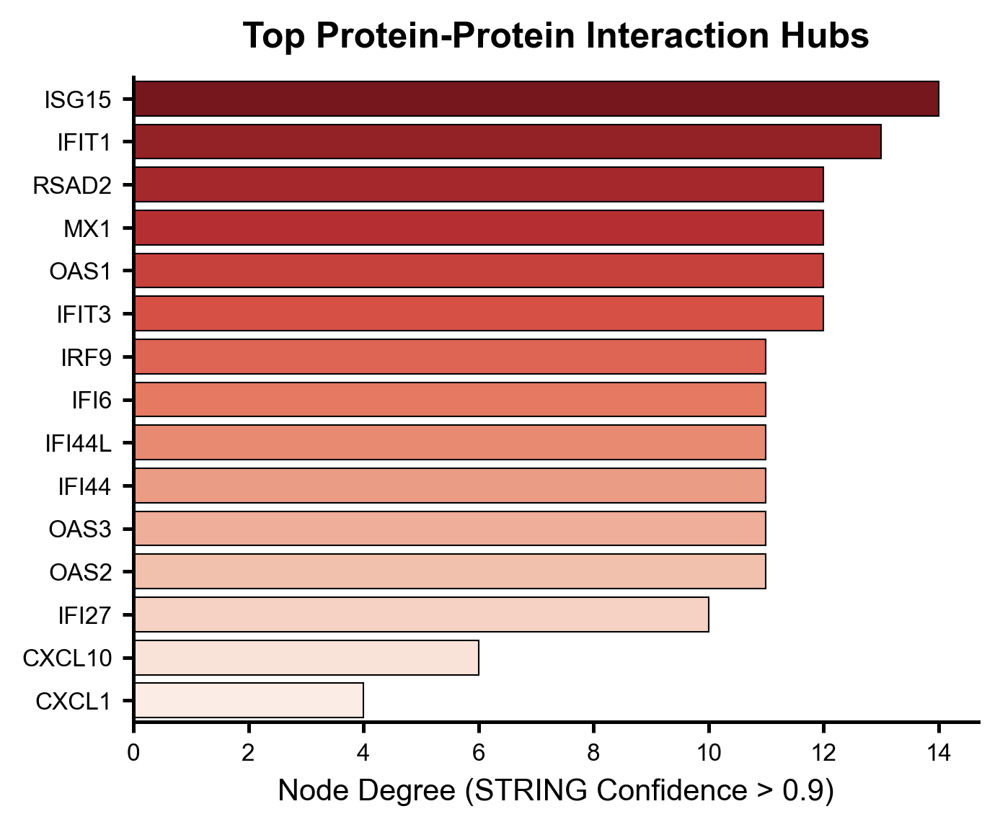

# Convergent miRNA Regulatory Networks in Zika and Dengue Virus Infection

This repository contains the complete analytical pipeline and generated visualizations for our multi-modal study investigating the shared transcriptomic and post-transcriptional features of Zika (ZIKV) and Dengue (DENV) virus infections.

## Hypothesis & Rationale
ZIKV and DENV are related mosquito-borne flaviviruses that share extensive sequence homology, geographical distribution, and clinical features. We hypothesized that the common pathological features of these viral infections—such as immune dysregulation and amplified viremia—are driven by a **Core Transcriptomic Signature** that is post-transcriptionally governed by a **convergent network of hub miRNAs**. 

By integrating bulk RNA-seq across multiple cohorts with single-cell RNA-seq (scRNA-seq), cell-cell communication modeling, and network topology analysis, this pipeline systematically defines this core molecular axis.

## Repository Structure

The `scripts/` directory contains all publication-ready analysis modules, stripped of experimental or debugging code. They are designed to be run sequentially:

- `Step_01_Fig_1_Bulk_DEG/`: Differential expression analysis across independent ZIKV and DENV bulk RNA-seq cohorts.
- `Step_02_Fig_2_Functional_Enrichment/`: GO and KEGG pathway enrichment mappings.
- `Step_03_Fig_3_scRNA_CellStates/`: High-resolution single-cell clustering, marker discovery, and UMAP embeddings.
- `Step_04_Fig_4_Pseudotime/`: Trajectory inference tracking cell states along the infection progression axis.
- `Step_05_Fig_5_CellChat/`: Receptor-ligand interactions mapping paracrine inflammatory signaling from highly-infected to bystander cells.
- `Step_06_Fig_6_CrossModal_Signature/`: Cross-modal validation linking bulk signatures to single-cell profiles.
- `Step_07_Fig_7_miRNA_Targets/`: Multi-database miRNA target predictions using stringent consensus scoring.
- `Step_08_Fig_8_miRNA_mRNA_Network/`: Assembly of the tripartite miRNA → mRNA → Pathway regulatory cascade.
- `Step_09_Fig_9_PPI_Network/`: Protein-protein interaction (PPI) network mapping via STRING and degree centrality scoring.
- `Step_11_Biomarker_ROC/`: Leave-one-out logistic regression modeling evaluating the core signature's diagnostic power.

*Note: Shared visualization aesthetics are enforced using the `utils/pub_style.py` module.*

## Key Findings & Visualizations

### 1. Robust Conserved Transcriptomic Shift
Across multiple cohorts, DENV and ZIKV trigger a massive conserved transcriptional response, heavily skewed toward the upregulation of interferon-stimulated genes (ISGs) and pro-apoptotic factors.

<p align="center">
  
</p>

### 2. Single-Cell Resolution of Infection States
Single-cell decomposition reveals distinct high-infection and bystander populations. The high-infection compartment serves as a major paracrine signaling hub that broadcasts inflammatory cytokines to neighboring uninfected cells.

<p align="center">
  
</p>

### 3. A Convergent Regulatory Hub
Network topology analysis (degree centrality and betweenness) uncovers a tightly interconnected module of core protein effectors (e.g., OAS1-3, ISG15, STAT1) regulated by three dominant hub miRNAs: hsa-miR-3135b, hsa-miR-491-5p, and hsa-miR-140-3p. 

<p align="center">
  
</p>

## Usage
To reproduce the figures in this repository:
1. Clone this repository.
2. Ensure you have the required dependencies installed (e.g., `scanpy`, `networkx`, `pandas`, `seaborn`).
3. Run the scripts sequentially using Python 3.10+.

```bash
python scripts/Step_01_Fig_1_Bulk_DEG/plot_bulk_volcano.py
```
*(Data files are expected to be present in the designated paths specified within the scripts).*

---
*For further information on methodology, mathematical modeling, and raw data accession numbers, please refer to the primary manuscript.*
