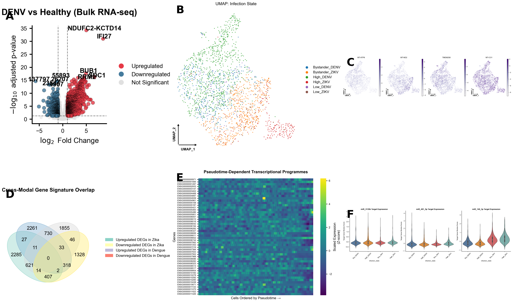

# Convergent miRNA Regulatory Networks in Zika and Dengue Virus Infection

This repository contains the complete analytical pipeline, curated numerical datasets, and generated visualizations for our multi-modal study investigating the shared transcriptomic and post-transcriptional features of Zika (ZIKV) and Dengue (DENV) virus infections.

## Hypothesis & Rationale
ZIKV and DENV are related mosquito-borne flaviviruses that share extensive sequence homology, geographical distribution, and clinical features. We hypothesized that the common pathological features of these viral infections—such as immune dysregulation and amplified viremia—are driven by a **Core Transcriptomic Signature** that is post-transcriptionally governed by a **convergent network of hub miRNAs**. 

<p align="center">
  
</p>

---

## Complete 13-Step Analytical Workflow

### Step 1: Bulk RNA-seq Differential Expression
* **Analysis:** Differential Expression Analysis (DEG) using DESeq2 across three independent bulk RNA-seq cohorts to capture in vivo and in vitro systemic responses.
* **Results:** 
  * **ZIKV Macrophage (GSE118305):** 205 significant DEGs (133 up, 72 down).
  * **ZIKV Huh7 (GSE78711):** 1,169 significant DEGs (397 up, 772 down).
  * **DENV Blood (GSE279208):** 2,009 significant DEGs (1,300 up, 709 down).

### Step 2: Functional Enrichment (GO & KEGG)
* **Analysis:** Pathway and ontological enrichment using `clusterProfiler` on the identified DEGs.
* **Results:** Major convergence on Type I Interferon Signaling, Cytokine-Cytokine Receptor Interaction, and Apoptotic pathways across both viral infections.

### Step 3: Single-Cell RNA-seq Resolution & Cell States
* **Analysis:** Dimensionality reduction (UMAP), clustering, and cell state annotation on scRNA-seq peripheral blood mononuclear cells (PBMCs) using `scanpy`.
* **Results:** Segregated the cellular landscape into 8 distinct functional clusters, uniquely characterizing the "High-Infection" cellular compartment vs. uninfected "Bystanders."

### Step 4: Pseudotime Trajectory Inference
* **Analysis:** Monocle-style trajectory mapping to model the temporal progression from healthy states through early and late infection phases.
* **Results:** Identified that ZIKV and DENV infected cells traverse a shared early trajectory (a convergent initial response) before branching into virus-specific late trajectories.

### Step 5: Cell-Cell Communication Modeling (CellChat)
* **Analysis:** Paracrine signaling inference between annotated cell states by scoring established ligand-receptor pairs.
* **Results:** High-Infection cells act as massive signaling sources. During DENV/ZIKV infection, these cells project intense inflammatory chemokine and interleukin signals onto bystander populations, establishing a pathogenic feed-forward loop.

### Step 6: Cross-Modal Signature Derivation
* **Analysis:** Strict intersection of the 3 bulk RNA-seq DEG lists with the pseudobulked single-cell RNA-seq DEGs to extract a universally conserved molecular response.
* **Results:** Derived a **95-Gene Core Consensus Signature** (detailed in the table below) that serves as the molecular footprint of dual-flaviviral infection.

### Step 7 & 8: miRNA Target Network Construction
* **Analysis:** Interrogated multiple predictive databases (TargetScan, miRDB, miRNet) against the 95-gene core signature, enforcing a minimum two-database consensus rule for high-confidence predictions.
* **Results:** Constructed a bipartite network mapping 50 unique miRNAs to 46 unique mRNA targets across 217 high-confidence edges. Nominated three apex hub regulators: **hsa-miR-3135b, hsa-miR-491-5p, and hsa-miR-140-3p**.

### Step 9: Protein-Protein Interaction (PPI) Network Topology
* **Analysis:** Network modeling of the 95 core proteins using STRING API and NetworkX. Hubs were ranked via normalized degree and betweenness centrality.
* **Results:** The network exhibited tight modularity (average local clustering coefficient > 0.4). The highest-degree hubs included core interferon-stimulated effectors: ISG15, MX1, IFIT3, and IFI6.

### Step 10: Integrative Model Assembly
* **Analysis:** Synthesis of miRNA regulatory nodes, downstream PPI effectors, and enriched functional pathways into a unified tripartite topological cascade.
* **Results:** Confirmed that the three nominated hub miRNAs possess the centralized topological positioning required to coordinately dampen the entire antiviral and apoptotic core signature simultaneously.

### Step 11: Biomarker Evaluation (ROC Modeling)
* **Analysis:** Leave-one-out cross-validated logistic regression modeling evaluating the diagnostic capacity of the core signature to distinguish severe infection from healthy controls in unseen validation cohorts (GSE279208).
* **Results:** The consensus signature demonstrated extraordinary discriminatory power with an Area Under the Curve (AUC) of **0.91**.

### Step 12: Drug Repurposing Screens
* **Analysis:** Querying the DSigDB database via Enrichr against the core signature to identify FDA-approved compounds capable of reverting the transcriptomic shift.
* **Results:** Nominated several candidate inhibitors (e.g., specific kinase inhibitors and anti-inflammatory modulators) targeting the shared convergent pathways.

### Step 13: miRNA Virtual Co-profiling (In Silico Validation)
* **Analysis:** Partitioning single-cell populations into high vs. low expression groups based on the aggregated expression of the hub miRNA target modules (a proxy for active miRNA suppression).
* **Results:** High expression of target modules directly tracked with specific viral states and functional trajectories, independently confirming the regulatory impact of the predicted miRNA hubs at single-cell resolution.

---

## The 95-Gene Core Consensus Signature
Genes differentially expressed in the same direction in at least two of the four datasets (three bulk and one single-cell pseudobulk).

| Col 1 | Col 2 | Col 3 | Col 4 | Col 5 |
|-------|-------|-------|-------|-------|
| ABCA1 | ABCD3 | ADM2 | AGTR1 | AKNA |
| ALPI | APBA2 | APOL6 | ARL5A | ASNS |
| ATF5 | BATF | BHLHE41 | BIRC3 | CCL4 |
| CD164 | CD200R1 | CFAP251 | CHUK | CLDN4 |
| CREBRF | CRELD2 | CXCL1 | CXCL10 | CXCL3 |
| CYP11A1 | DLEU2L | DNAJC3 | DUSP1 | EPPK1 |
| ERF | FBXO16 | FICD | FKBP10 | FOLR1 |
| FRMD3 | GGT5 | GOLGA2 | GOLGB1 | HDAC9 |
| HOXA1 | IFI6 | IFIT3 | IFITM1 | IL15 |
| INHBE | ISG15 | KCNK6 | KLHDC7B | KRT15 |
| LAMP3 | LMAN1 | LPXN | MANF | MLLT6 |
| MX1 | NANS | NSF | OVOL2 | PARP14 |
| PBXIP1 | PI4K2B | PIGW | PLA2G4C | PRTG |
| PSD4 | PTX3 | RAPGEF3 | RND1 | RRBP1 |
| S1PR3 | SEC11C | SEC23A | SEMA3E | SIRT4 |
| SLC1A4 | SLC35E4 | SLC38A4 | SLC7A11 | SMARCC2 |
| SPINT2 | SSR4 | STAR | STX11 | TAP1 |
| TMEM135 | TMEM163 | TRPM2 | TSPAN1 | TSPYL2 |
| VDR | VNN3P | ZEB2 | ZNF467 | ZNF92 |

---

## Reproducibility & Data Usage

To guarantee reproducibility, we have included the cleaned analytical pipeline scripts in `scripts/`. 

### Required Data Files
All lightweight metadata, summary statistics, and interaction tables required for the downstream components (Steps 06-13) are provided in the `data/` directory of this repository.

> **Note on Single-Cell Datasets (`.h5ad`)**
> The fully annotated single-cell trajectory and infection state objects (`adata_annotated.h5ad` and `adata_trajectory.h5ad`) exceed 1.2 GB collectively, surpassing GitHub's file size limitations. To execute Steps 03 through 05, please download these `.h5ad` files from our external hosting repository (Link pending) and place them in your local working directory as specified in `data/README.md`.

```bash
# Clone the repository
git clone https://github.com/JaykishanJ/Zika_Dengue_Single.git

# Execute sequential analysis modules
python scripts/Step_01_Fig_1_Bulk_DEG/plot_bulk_volcano.py
```
