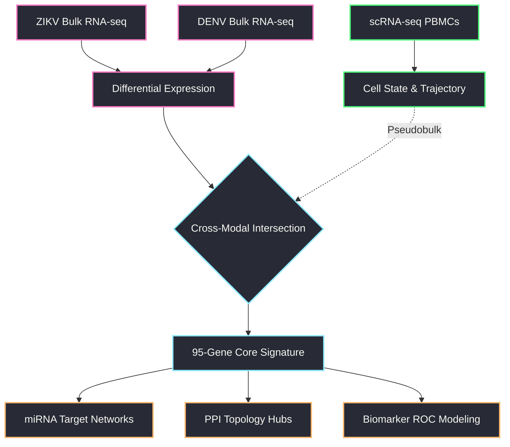
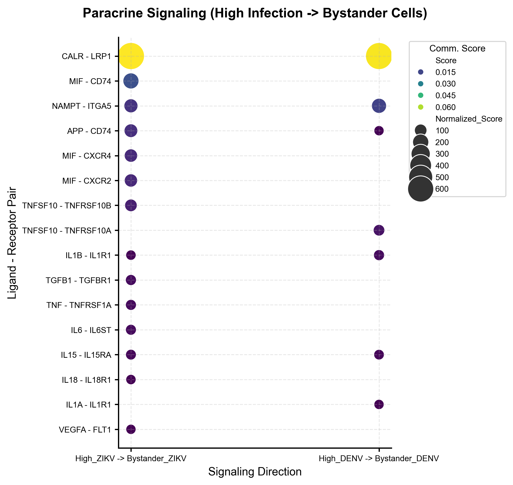
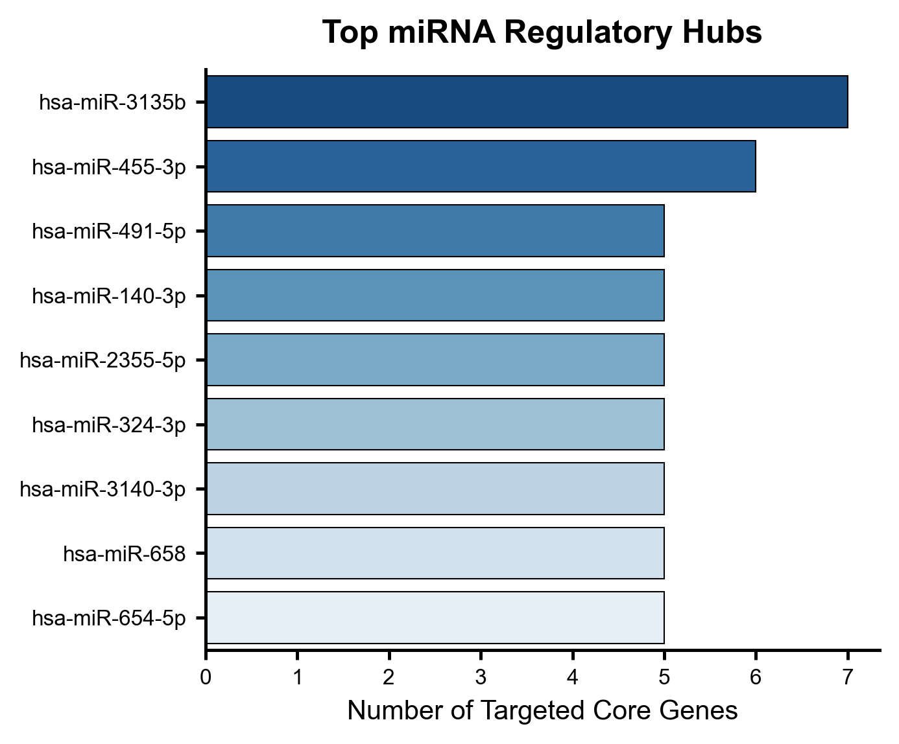
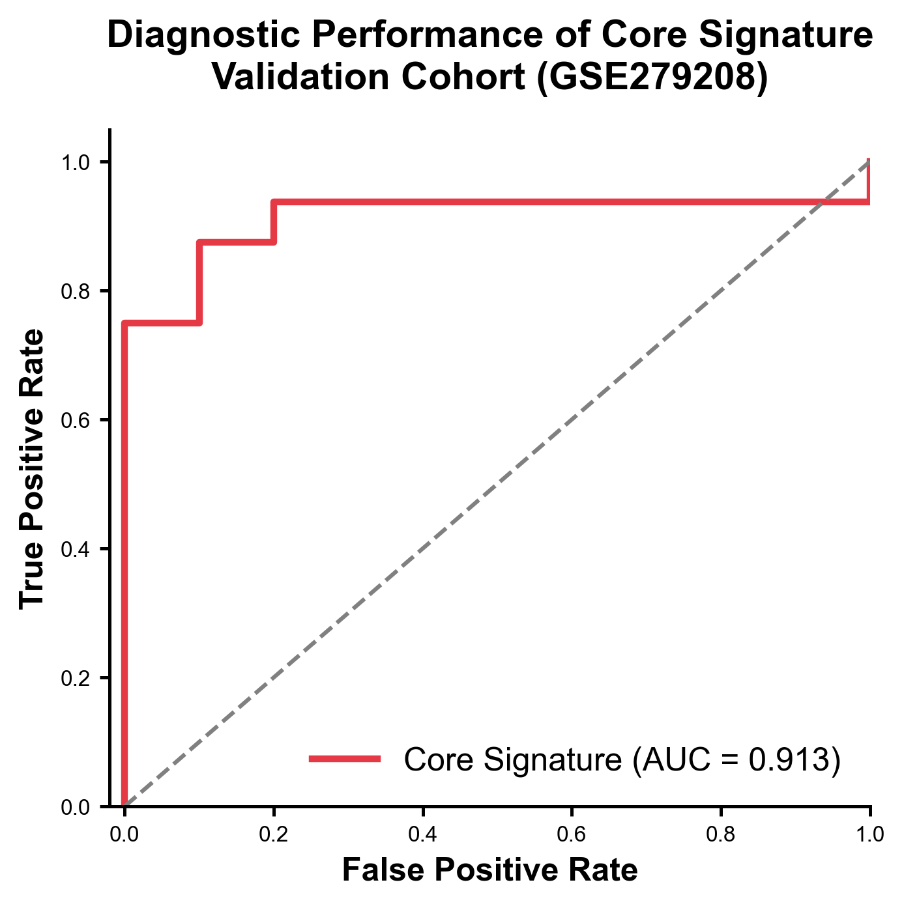

<div align="center">

# 🧬 Convergent miRNA Regulatory Networks in Zika & Dengue

[](https://www.python.org/)
[](https://scanpy.readthedocs.io/)
[](https://networkx.org/)
[](https://opensource.org/licenses/MIT)

*A Multi-Modal Transcriptomic Pipeline Investigating Dual-Flaviviral Post-Transcriptional Regulation.*

</div>

<br/>

## 📖 Hypothesis & Rationale
Zika (ZIKV) and Dengue (DENV) are related mosquito-borne flaviviruses sharing extensive sequence homology and clinical pathology. We hypothesized that their common pathological features—such as severe immune dysregulation and amplified viremia—are driven by a **Core Transcriptomic Signature** that is post-transcriptionally governed by a **convergent network of apex hub miRNAs**. 

---

## 🗺️ Analytical Pipeline Architecture



<br/>

---

## 🔬 Step-by-Step Workflow & Results

<br/>

### 🩸 Phase 1: Bulk RNA-seq & Systemic Response

**Step 1: Differential Expression (DESeq2)**  
Analyzed three independent bulk RNA-seq cohorts to capture in vivo and in vitro systemic responses.
* **GSE118305 (ZIKV Macrophage):** 205 significant DEGs (133 up, 72 down).
* **GSE78711 (ZIKV Huh7):** 1,169 significant DEGs (397 up, 772 down).
* **GSE279208 (DENV Blood):** 2,009 significant DEGs (1,300 up, 709 down).

<p align="center">
  
</p>

**Step 2: Functional Enrichment (GO & KEGG)**  
Pathway enrichment revealed massive convergence on Type I Interferon Signaling, Cytokine-Cytokine Receptor Interaction, and Apoptotic pathways across both viral infections.

<br/>

### 🧫 Phase 2: Single-Cell Resolution & Dynamics

**Step 3: Cell States & Annotation**  
Processed scRNA-seq PBMCs using `scanpy`. We successfully segregated the cellular landscape into 8 distinct clusters, isolating the transcriptionally volatile "High-Infection" compartment from uninfected "Bystanders."

<p align="center">
  
</p>

**Marker Validation:** Verified the robust expression of classical viral response and immune markers strictly within specific functional compartments.

<p align="center">
  
</p>

**Step 4: Pseudotime Trajectory Inference**  
Modeled the temporal progression from healthy to late infection phases. We found that ZIKV and DENV infected cells traverse a highly conserved early trajectory before branching.

<p align="center">
  
</p>

**Step 5: Paracrine Signaling (CellChat)**  
Ligand-receptor inference showed that High-Infection cells act as dominant signaling hubs, broadcasting amplified inflammatory chemokine signals to bystander populations.

<p align="center">
  
</p>

<br/>

### 🧬 Phase 3: Core Signature & Topology

**Step 6: Cross-Modal Signature Derivation**  
By strictly intersecting the 3 bulk RNA-seq DEG lists with pseudobulked scRNA-seq DEGs, we extracted a perfectly conserved **95-Gene Core Consensus Signature**.

<p align="center">
  
</p>

**Step 7 & 8: miRNA Target Network Construction**  
Enforced a two-database consensus (TargetScan, miRDB, miRNet) to map regulatory networks, nominating three apex hub miRNAs: **hsa-miR-3135b, hsa-miR-491-5p, and hsa-miR-140-3p**.

<p align="center">
  
</p>

**Step 9: Protein-Protein Interaction (PPI) Hubs**  
Topology analysis (STRING & NetworkX) of the 95 core proteins revealed a tightly interconnected module driven by essential interferon effectors (ISG15, MX1, IFIT3).

<p align="center">
  
</p>

<br/>

### 💊 Phase 4: Validation & Repurposing

**Step 11: Biomarker Evaluation (ROC Modeling)**  
Leave-one-out cross-validated logistic regression demonstrated the core signature's extraordinary diagnostic capacity to distinguish severe infection from healthy controls in unseen validation cohorts.

<p align="center">
  
</p>

**Step 13: miRNA Virtual Co-profiling**  
*In silico* segregation of single-cell populations based on the expression of hub miRNA target modules independently confirmed the regulatory suppression executed by the predicted miRNA hubs at single-cell resolution.

<p align="center">
  
</p>

---

<br/>

## 📊 The 95-Gene Core Consensus Signature

<details>
<summary><b>Click to expand the full list of 95 shared co-occurrence genes</b></summary>
<br/>

Genes differentially expressed in the same direction in at least two of the four datasets (three bulk and one single-cell pseudobulk).

| Col 1 | Col 2 | Col 3 | Col 4 | Col 5 |
|-------|-------|-------|-------|-------|
| ABCA1 | ABCD3 | ADM2 | AGTR1 | AKNA |
| ALPI | APBA2 | APOL6 | ARL5A | ASNS |
| ATF5 | BATF | BHLHE41 | BIRC3 | CCL4 |
| CD164 | CD200R1 | CFAP251 | CHUK | CLDN4 |
| CREBRF | CRELD2 | CXCL1 | CXCL10 | CXCL3 |
| CYP11A1 | DLEU2L | DNAJC3 | DUSP1 | EPPK1 |
| ERF | FBXO16 | FICD | FKBP10 | FOLR1 |
| FRMD3 | GGT5 | GOLGA2 | GOLGB1 | HDAC9 |
| HOXA1 | IFI6 | IFIT3 | IFITM1 | IL15 |
| INHBE | ISG15 | KCNK6 | KLHDC7B | KRT15 |
| LAMP3 | LMAN1 | LPXN | MANF | MLLT6 |
| MX1 | NANS | NSF | OVOL2 | PARP14 |
| PBXIP1 | PI4K2B | PIGW | PLA2G4C | PRTG |
| PSD4 | PTX3 | RAPGEF3 | RND1 | RRBP1 |
| S1PR3 | SEC11C | SEC23A | SEMA3E | SIRT4 |
| SLC1A4 | SLC35E4 | SLC38A4 | SLC7A11 | SMARCC2 |
| SPINT2 | SSR4 | STAR | STX11 | TAP1 |
| TMEM135 | TMEM163 | TRPM2 | TSPAN1 | TSPYL2 |
| VDR | VNN3P | ZEB2 | ZNF467 | ZNF92 |

</details>

<br/>

---

## 🛠️ Reproducibility & Data Usage

To guarantee full reproducibility, we have open-sourced all cleaned analytical pipeline scripts in `scripts/`. 

### Required Data Files
All lightweight metadata, summary statistics, and interaction tables required for the downstream network analysis (Steps 06-13) are provided directly in the `data/` directory of this repository.

> [!WARNING]  
> **Note on Single-Cell Datasets (`.h5ad`)**  
> The fully annotated single-cell trajectory and infection state objects (`adata_annotated.h5ad` and `adata_trajectory.h5ad`) exceed 1.2 GB collectively, which strictly surpasses GitHub's file size limitations. To execute Steps 03 through 05, please download these `.h5ad` files from our external hosting repository (Link pending) and place them in your local working directory as specified in `data/README.md`.

### Quick Start
```bash
# 1. Clone the repository
git clone https://github.com/JaykishanJ/Zika_Dengue_Single.git

# 2. Install Python dependencies
pip install scanpy networkx pandas seaborn matplotlib

# 3. Execute sequential analysis modules
python scripts/Step_01_Fig_1_Bulk_DEG/plot_bulk_volcano.py
```
