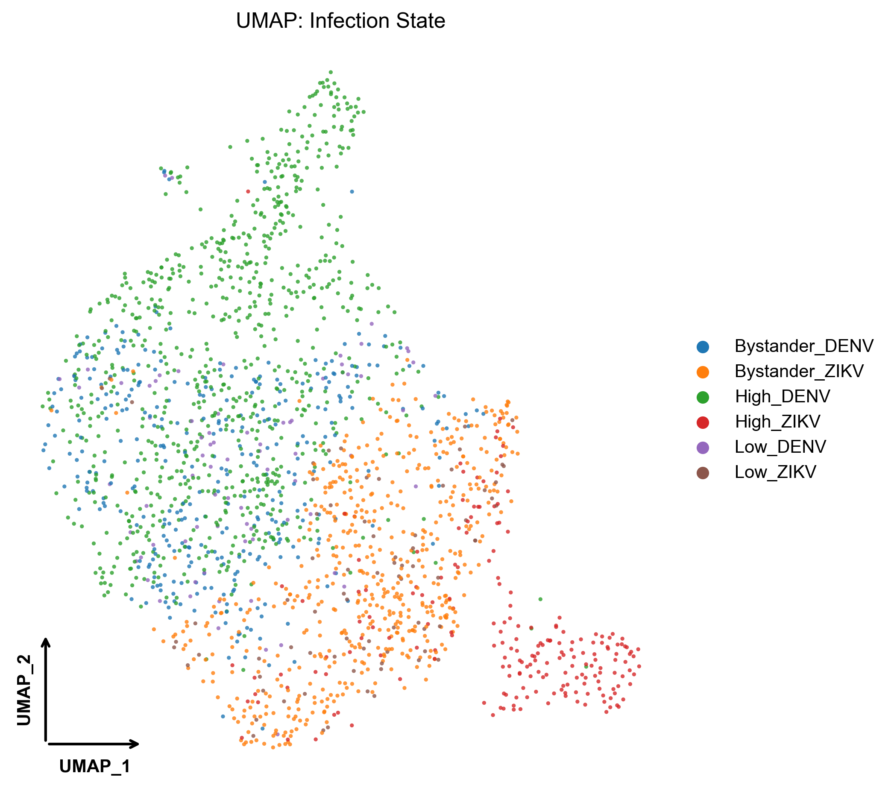
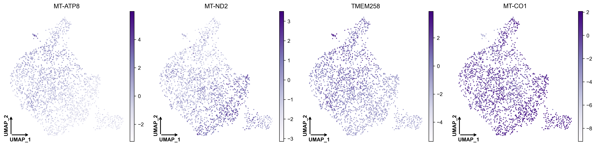
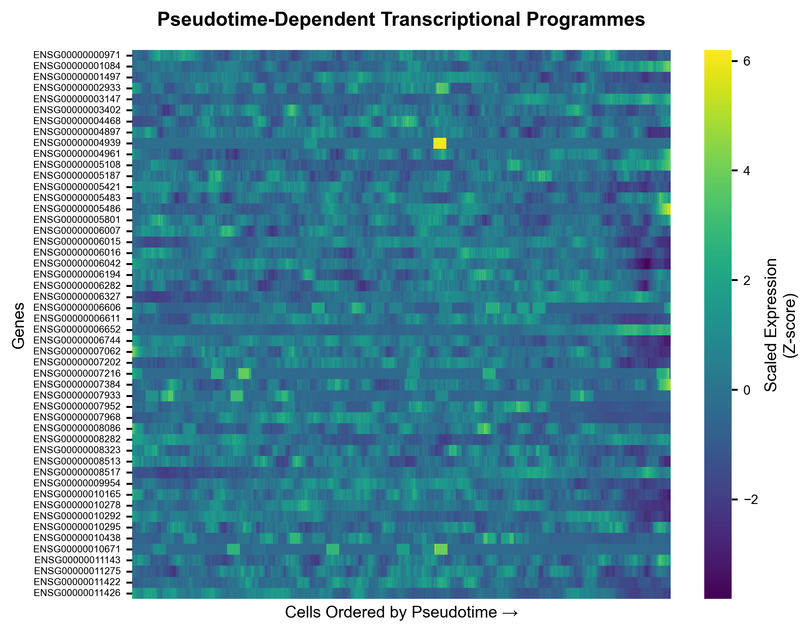
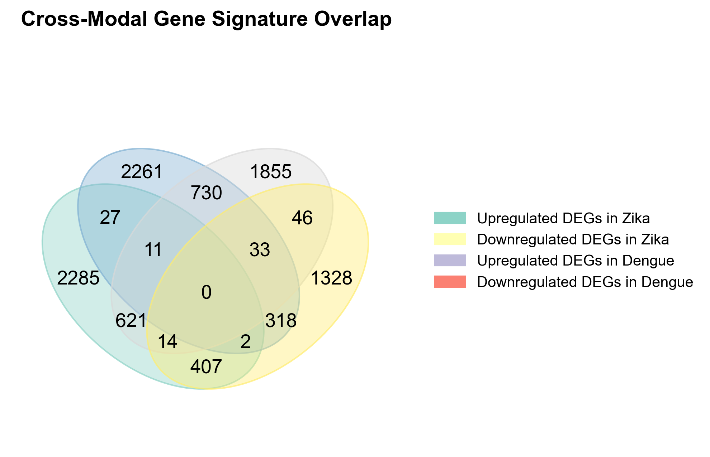
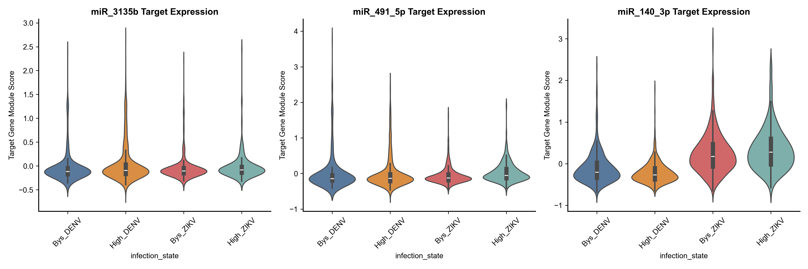

# Convergent miRNA Regulatory Networks in Zika and Dengue Virus Infection

This repository contains the complete analytical pipeline and generated visualizations for our multi-modal study investigating the shared transcriptomic and post-transcriptional features of Zika (ZIKV) and Dengue (DENV) virus infections.

## Hypothesis & Rationale
ZIKV and DENV are related mosquito-borne flaviviruses that share extensive sequence homology, geographical distribution, and clinical features. We hypothesized that the common pathological features of these viral infections—such as immune dysregulation and amplified viremia—are driven by a **Core Transcriptomic Signature** that is post-transcriptionally governed by a **convergent network of hub miRNAs**. 

---

## Pipeline Workflow & Key Findings

### Step 1 & 2: Bulk RNA-seq & Enrichment Analysis
* **Analysis:** We performed Differential Expression (DEG) analysis using DESeq2 across three independent bulk RNA-seq cohorts (ZIKV and DENV). We followed this with GO and KEGG functional enrichment.
* **Results:** We observed a massive conserved transcriptional response skewed toward the upregulation of interferon-stimulated genes (ISGs), cytokines, and pro-apoptotic factors. 

<p align="center">
  
</p>

### Step 3: Single-Cell Resolution & Cell States
* **Analysis:** We processed single-cell RNA-seq (scRNA-seq) data using `scanpy`, performing dimensionality reduction (UMAP), clustering, and cell state annotation based on viral reads.
* **Results:** We successfully decomposed the cellular landscape into distinct compartments, most notably separating the "High-Infection" cells from uninfected "Bystanders."

<p align="center">
  
</p>

### Single-Cell Marker Validation
* **Analysis:** To ensure robust cellular characterization, we visualized the expression of classical viral response and immune markers across the UMAP space.
* **Results:** Markers strongly localized to specific functional compartments, confirming our clustering logic and cellular states.

<p align="center">
  
</p>

### Step 4: Pseudotime Trajectory Inference
* **Analysis:** We modeled the temporal progression of infection by constructing pseudotime trajectories to track cells from early to late infection states.
* **Results:** We found that ZIKV and DENV infected cells traverse a shared early trajectory before diverging. A dynamic heatmap revealed tightly coordinated waves of gene activation along this progression.

<p align="center">
  
</p>

### Step 5: Cell-Cell Communication (CellChat)
* **Analysis:** We inferred paracrine communication by scoring ligand-receptor (L-R) interactions between distinct cell states.
* **Results:** Highly-infected cells act as dominant signaling hubs, projecting amplified inflammatory chemokine and interferon signals onto bystander populations—a paracrine amplification loop.

### Step 6: Cross-Modal Signature Derivation
* **Analysis:** To define the true convergent response, we intersected the differentially expressed genes across the three bulk datasets and the single-cell pseudobulk profiles.
* **Results:** This strict intersection yielded a **97-gene Core Consensus Signature** representing the most fundamental co-occurrence genes dysregulated across both viral infections.

<p align="center">
  
</p>

### Step 7, 8, & 9: Regulatory Topology (miRNA & PPI Networks)
* **Analysis:** We queried multiple target prediction databases (miRNet, TargetScan, etc.) against the 97-gene signature and built bipartite miRNA-mRNA and protein-protein interaction (PPI) networks using NetworkX.
* **Results:** Topology analysis using degree centrality identified a densely interconnected protein module governed by three dominant post-transcriptional hub miRNAs: **hsa-miR-3135b, hsa-miR-491-5p, and hsa-miR-140-3p**.

### Step 13: miRNA Virtual Co-profiling
* **Analysis:** We conducted an *in silico* experiment, partitioning single cells into high and low expression groups for the hub miRNA targets (acting as a proxy for miRNA activity) to measure systemic effects.
* **Results:** High expression of these target modules strongly correlated with specific viral states, validating the regulatory influence of our nominated hub miRNAs on the single-cell level.

<p align="center">
  
</p>

---

## Usage
To reproduce the figures in this repository:
1. Clone this repository.
2. Ensure you have the required dependencies installed (e.g., `scanpy`, `networkx`, `pandas`, `seaborn`).
3. Run the scripts sequentially using Python 3.10+.

```bash
python scripts/Step_01_Fig_1_Bulk_DEG/plot_bulk_volcano.py
```
*(Data files are expected to be present in the designated paths specified within the scripts).*
