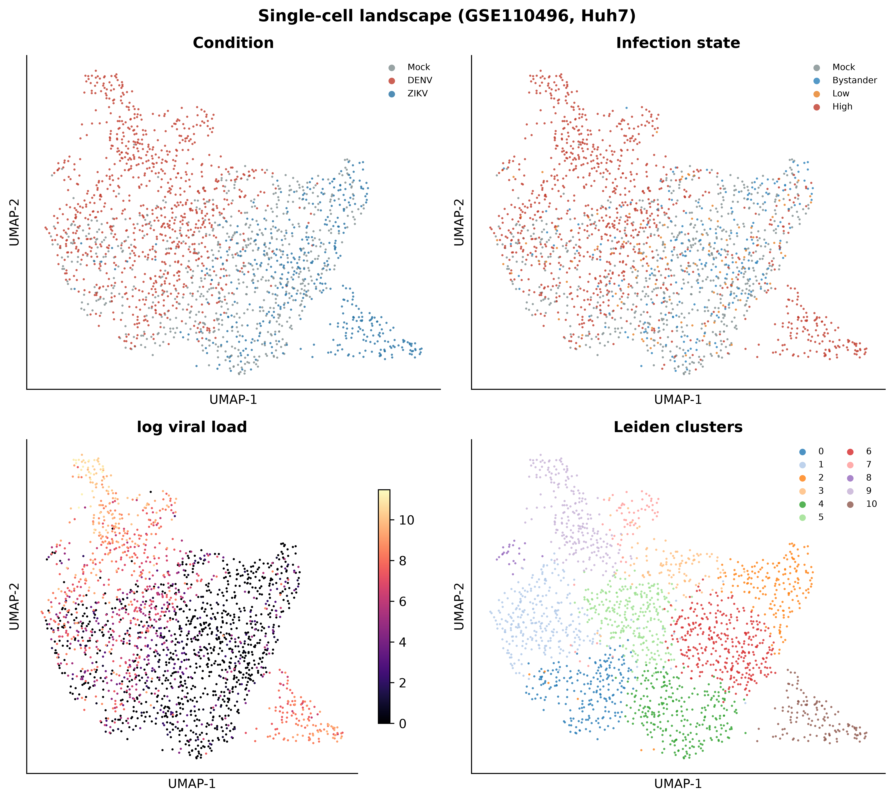
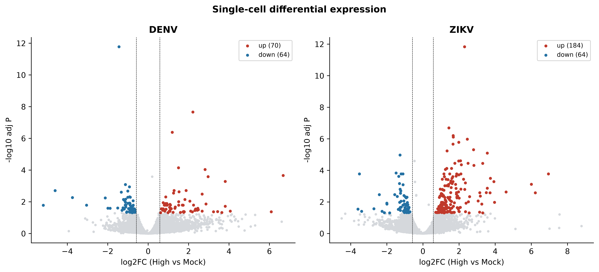
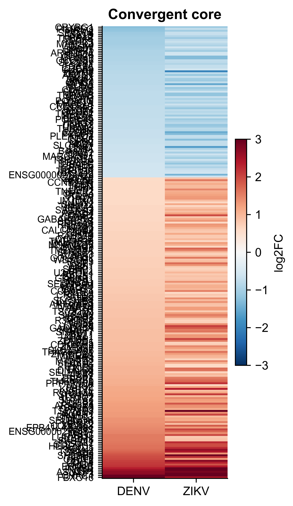
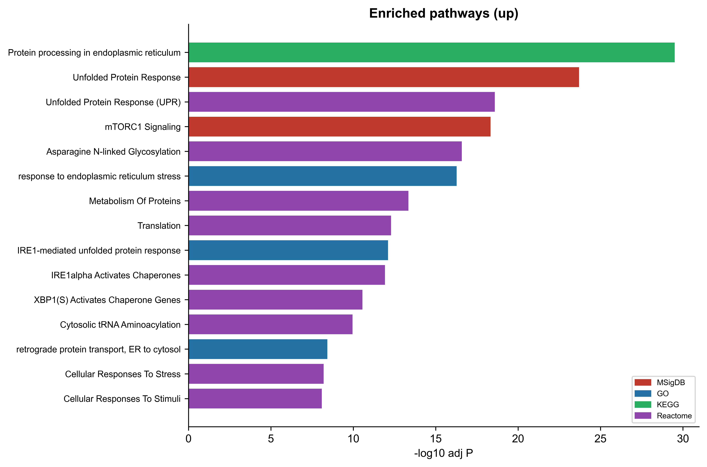
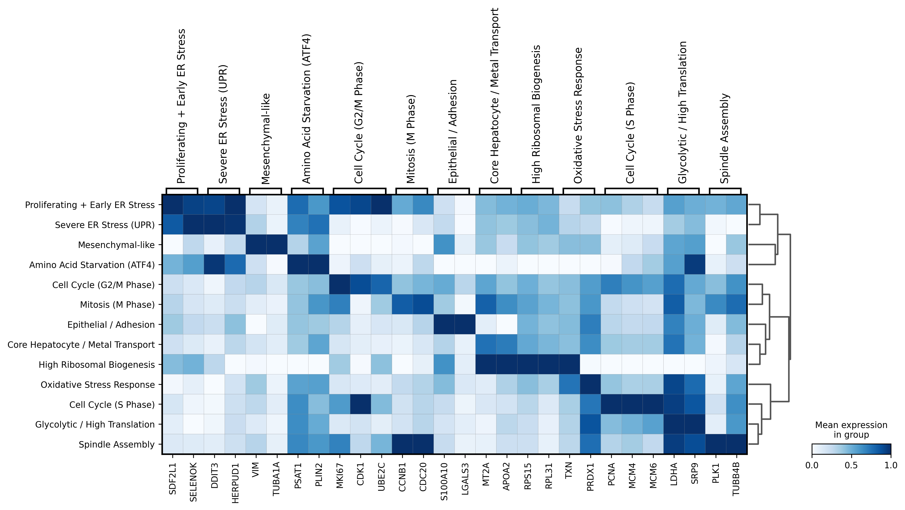
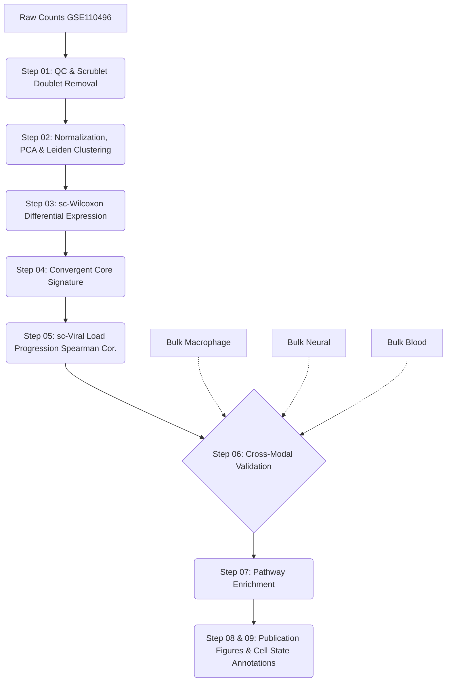

<div align="center">
  
# 🦠 Zika & Dengue Single-Cell and Cross-Modal Host Response Analysis

[](https://www.python.org/downloads/)
[](https://scanpy.readthedocs.io/)
[](https://opensource.org/licenses/MIT)

**A high-resolution, single-cell to bulk cross-modal analysis pipeline discovering universal and cell-specific host responses to Flavivirus infection.**

</div>

---

## 🔬 Overview

This repository contains a comprehensive bioinformatics pipeline designed to uncover the fundamental host response to **Zika (ZIKV)** and **Dengue (DENV)** viruses. 

By integrating **single-cell RNA sequencing (scRNA-seq)** of Huh7 hepatoma cells with **bulk RNA-seq** validation cohorts (macrophages, neural progenitors, and whole blood), this pipeline successfully deconvolutes the generic viral response from highly cell-type-specific survival mechanisms.

### 🌟 Key Discoveries
1. **The Universal "Pan-Flaviviral" Core:** Discovered a 245-gene core response shared between both viruses.
2. **ER Stress & Amino Acid Starvation:** Identified that both viruses trigger severe Unfolded Protein Response (UPR) and ATF4-mediated amino acid starvation as viral loads peak.
3. **The "GOLD" Biomarkers:** Validated *DNAJC3* and *HYOU1* as universal progression markers across 4 distinct human tissue models.
4. **Hepatocyte-Specific Mechanisms:** Uncovered a 234-gene module (including *SELENOK* and *SERP1*) deployed specifically by Huh7 cells to survive extreme viral ER stress.

---

## 📊 Key Visualizations & Biological Insights

A core tenet of this pipeline is producing high-quality, publication-ready figures that tell a clear biological story.

<div align="center">

### 1. The Single-Cell Viral Landscape
*Single-cell transcriptomic landscape of Huh7 cells mapping viral load and infection states.*


### 2. Massive Transcriptional Reprogramming
*Volcano plots showing the sheer scale of host response to High ZIKV and DENV infection.*


### 3. The 245-Gene Convergent Core
*A heat map revealing the identical set of genes hijacked by both viruses.*


### 4. Pathway Enrichment (Biological Mechanism)
*Gene Set Enrichment Analysis (GSEA) proving both viruses trigger Unfolded Protein Response (UPR) and ATF4-mediated amino acid starvation.*


### 5. Cell-Type Specific Responses (Huh7)
*Canonical markers defining the distinct biological states of the Huh7 hepatoma cells.*


</div>

---

## 🛠️ Step-by-Step Pipeline Architecture

The pipeline is organized into 9 highly modular Python steps, operating on `.h5ad` AnnData objects.


```mermaid
graph TD
    A[Raw Counts GSE110496] --> B(Step 01: QC & Scrublet Doublet Removal)
    B --> C(Step 02: Normalization, PCA & Leiden Clustering)
    C --> D(Step 03: sc-Wilcoxon Differential Expression)
    D --> E(Step 04: Convergent Core Signature)
    E --> F(Step 05: sc-Viral Load Progression Spearman Cor.)
    
    F --> G{Step 06: Cross-Modal Validation}
    Bulk1[Bulk Macrophage] -.-> G
    Bulk2[Bulk Neural] -.-> G
    Bulk3[Bulk Blood] -.-> G
    
    G --> H(Step 07: Pathway Enrichment)
    H --> I(Step 08 & 09: Publication Figures & Cell State Annotations)
```

| Step | Module | Description |
| :--- | :--- | :--- |
| **01** | `qc` | Mitochondrial filtering, gene count QC, and Scrublet doublet detection. |
| **02** | `clustering` | Log1p normalization, cell cycle regression, PCA, UMAP, and Leiden clustering. |
| **03** | `differential_expression` | Wilcoxon rank-sum testing to define High-infection vs Mock DEGs. |
| **04** | `core_signature` | Intersecting ZIKV and DENV to define the 245-gene convergent core. |
| **05** | `progression` | Spearman correlation modeling to find genes strictly tracking with viral load. |
| **05b** | `bulk_differential_expression` | Processing 3 independent bulk RNA-seq cohorts for validation. |
| **06** | `crossmodal_validation` | Tiering system (Tier 1 to 4) validating sc-genes against bulk cohorts. |
| **07** | `enrichment` | Pathway enrichment analysis (GSEA) of the viral progression signature. |
| **08** | `figures` | Automated generation of 600 DPI publication-ready Volcano/Heatmap plots. |
| **09** | `marker_analysis` | Formal cell-state annotation (One-vs-Rest) and cell-specific visualizations. |

---

## 🚀 Getting Started & Reproducibility

### 1. Environment Setup
Create a virtual environment and install the exact dependencies used in this pipeline:
```bash
python -m venv venv
source venv/bin/activate  # On Windows use `venv\Scripts\activate`
pip install -r requirements.txt
```

### 2. Running the Pipeline
The pipeline is designed to run end-to-end sequentially. Execute the runner script to reproduce the entire analysis from scratch:
```bash
python run_pipeline.py
```
*(Average execution time: ~12-15 minutes on a standard laptop)*

---

## 📁 Repository Structure

```text
├── Step01_qc/                     # Quality control & doublet removal
├── Step02_clustering/             # Dimensionality reduction & clustering
├── Step03_differential_expression/# Single-cell Wilcoxon tests
├── Step04_core_signature/         # Viral intersection logic
├── Step05_progression/            # Continuous viral load modeling
├── Step05b_bulk_differential_expression/ # Bulk processing
├── Step06_crossmodal_validation/  # Multi-tissue validation tiering
├── Step07_enrichment/             # Pathway analysis
├── Step08_figures/                # Publication figure generation
├── Step09_marker_analysis/        # Cell state annotations & UMAPs
├── requirements.txt               # Strict dependency locks
├── run_pipeline.py                # Master execution script
└── PROJECT_REPORT.txt             # Detailed statistical breakdown
```

---

<div align="center">
<i>This pipeline was developed to ensure maximum statistical rigor, utilizing Wilcoxon rank-sum for scRNA-seq, independent progression modeling, and multi-tissue validation to eliminate pseudoreplication bias.</i>
</div>
